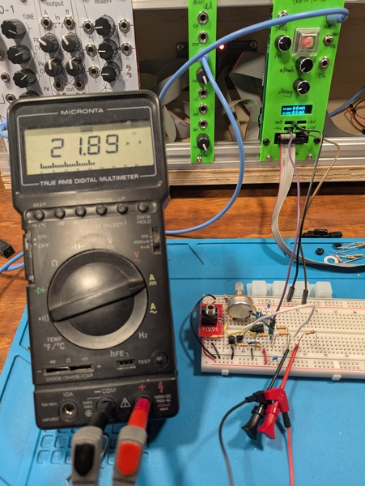

---
date:
  created: 2025-12-09
links:
  - Design note: references/buildingblocks/lin2exp.md
tags:
  - building-block
  - reference
authors:
  - idyllm
slug: linear-2-exp
---

# Linear to Exponential Conversion

A couple of designs now have required linear to exponential conversion for the control signal, so I've added it as my first "building block" note in the reference section. This version is the one of the more sophisticated ones, including buffering and temperature compensation, so it's suitable for designs requiring V/oct tracking. 

<!-- more -->

I extracted the design note from the (unimplemented) design for the [analog gate delay](../../projects/gate-delay/design/gate_delay_theory.md), which I based on Aaron Lanterman's lecture ([ECE4450 L18](https://www.youtube.com/watch?v=ZWJhApUmfEU)). I tried to cover a few different variations, namely

* inverting and non-inverting inputs
* NPN- and PNP-based current mirrors

the later being useful for supplying the amplifier bias current to the LM13700 OTA.

## Test Case

I put it together on the breadboard using an unmatched pair of BC557 PNP transistors and a regular 2.2k resistor (no PTC thermistor). It more or less worked as designed: with the offset pot around center (0V), the bias current is 21uA.

## Other References

In addition to Aaron Lanterman's lecture, a couple of very useful references are

* Rene Schmitz, "A tutorial on exponential converters and temperature compensation",[[schmitzbits.de](https://schmitzbits.de/expo_tutorial/index.html)]
* Hal Chamberlain, "Musical Applications of Microprocessors", 2nd ed., Hayden Books, 1987

with the later being the "reference" circuit topology for a VCO. 