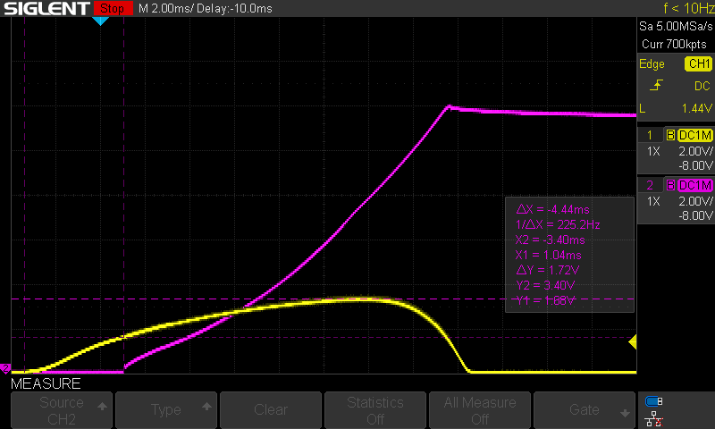

---
date:
  created: 2026-09-30
links:
  - System PSU: projects/psu/index.md
authors:
  - idyllm
slug: system-psu
---

# USB C Power Supply

One of my first projects was a USB-C power supply for Eurorack. Once I started prototyping a couple of DIY synth modules, I quickly realized that providing power is a bit of a nuisance. There weren't many simple off-the-shelf solutions, and DIY examples were limited (if you're just coming across this now, search for the "Meanwell RT65B" and stop reading here). Rather than just getting a commercial unit, I decided to design a dual-rail switched-mode power supply (SMPS) with a USB-C input. 

<!-- more -->

The initial design was based around an LT3757 in a [Cuk topology](https://en.wikipedia.org/wiki/%C4%86uk_converter) to generate the -12V rail. It was my first SMT board, and I ended up having a pair of them fabricated and completely assembled. Both of them worked well: one sits in my prototype testing case, and the other in my first instrument case. When I ran out of space in the "production" case and started planning to build another, I realized that I'd need another PSU. This gave me the opportunity to revisit the design. This time, I opted for a DCDC converted module rather than update the discrete SMPS for the +/- 12V rails. There are more notes about the design considerations in the [design](../../projects/psu/theory.md) document.

The rev. 1.0 board mostly worked, but I made a dumb mistake with the power switch: since it came after the switched PMOS, there was nothing to control the inrush current, and throwing the switch would drag down the bus supply, resetting the USB-C controller. Rev 1.1 improved things with some power scheduling and a switch that now acted on the enable pin of the REC30K. Unfortunately, the first time I plugged it in, it turned on briefly even though the switch was off. Another oversight: as the system power comes up, the signal on the gate of the MOSFET lags behind the CTRL internal pull-up. The MOSFET stays off long enough for the CTRL signal to cross the turn-on threshold, and the REC30K starts, bringing up the +5V rail with it. It turns off quickly, but with no load, it takes a few seconds for the +12V rail to drop back down. Here's what it looks like on the 'scope (yellow = CTRL, magenta = +12V rail):

The solution with the rev. 1.1 board is to bridge CTRL and +VIN with a 4.7u capacitor to hold it down longer. I added this to the rev 1.2 board, but I'm not sure if I'll fabricate that one: when I was testing this on the bench, it finally occurred to me that the USB-A supply is unprotected (it works fine: I plugged my Keystep in there). I guess that means that rev. 1.3 is next.

