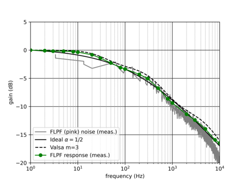

# Module Design

Notes about the module design go here. These may include some math $y = \alpha e^{ikx}$, which can also be multi-line

$$
\begin{align*}
    y &= mx + b \\
    V &= A_0 \cos(\omega t)
\end{align*}
$$

Sometimes, a picture is worth a thousand words



With mkdocs, the BOM can be included



If an example of code is required, place it in the fenced code block:

```c++
int add_two(int a) 
{
    return a + 2;
}

int main() 
{
    int b = add_two(3);
    return 0;
}
```

