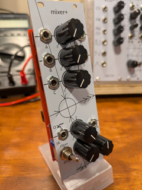

# Mixer+ Module

{align=right}

The Mixer+ module includes a basic three channel mixer as well as an
attenuverter with the option to add distortion to the output signal.

* Size: 8HP (40mm)
* Power: 10mA (+12V); 10mA (-12V) 

See the [design](theory.md) section for details on the theory and implementation of the module. 
An [assembly guide](assembly.md) contains the BOM and assembly instructions. The 
[schematic](assets/schematic.pdf) is also available for reference.

!!! repository "Project Source"

    The project files, including schematic and layout, are available on [github](https://github.com/xdylanm/modular-mixer).

## 3 Channel Mixer

The 3 channel mixer is designed for a maximum of unit gain per channel.

- DC coupled inputs
- Inverting and non-inverting outputs
- Simple output level indicator (red LED illuminates when $V_{pp} \gtrapprox 9V$)

## Attenuverter with Distortion and Offset

The input of the attenuverter is connected internally (normaled) to the
non-inverting output of the mixer. The internal connection is broken
when an external connection is made. The attenuverter output can be
optionally distorted or offset with a DC voltage.

- Input normaled to the non-inverting output of the mixer and is DC coupled
- Gain from -1 to 1
- Optional back-to-back diode distortion (dirty/clean switch)
- DC offset control adds -6 to +6V DC to output signal

## References

1.  Moritz Klein, "Designing a 3-channel mixer with diode distortion from scratch",
    [Youtube](https://www.youtube.com/watch?v=q8tmUgaXrEQ)
2.  Ray Wilson, "Ultra-Simple Mono Audio Mixer 1", [Music From Outer
    Space](https://musicfromouterspace.com/analogsynth_new/OLDIESBUTGOODIES/AUDIOMIXER/monomixer.html)
