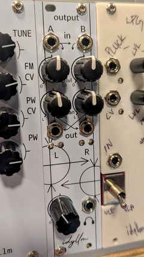

# Output Module

An audio output module for Eurorack, combining two mono input channels into a stereo output with a panning mixer. The stereo output is suitable to drive headphones or small speakers.

# Features

{align=right}

The output module provides some basic mixing and leveling before forwarding the audio signal to an amplifier for headphones. 

* Two input channels (A and B) with the second normaled to the first. 
* Independent input level adjustments for both channels
* Stereo panning mixer
* Level indicator (red indicates $V_{pp} \gtrapprox 9V$)
* Output volume control
* LM386 output amplifiers

See the [design](theory.md) section for details on the theory and implementation of the module. An [assembly guide](assembly.md) contains the BOM and assembly instructions. The [schematic](assets/schematic.pdf) is also available for reference.

# References

1. Ray Wilson, "Stereo Mixer" [MFOS](https://musicfromouterspace.com/analogsynth_new/STEREOMIXER2006/STEREOMIXER2006.php)
2. Elliot Williams, "You Can Have My LM386s When You Pry Them From My Cold Dead Hands" [Hackaday](https://hackaday.com/2016/12/07/you-can-have-my-lm386s-when-you-pry-them-from-my-cold-dead-hands/)
3. "Mixer", [Befaco](https://www.befaco.org/mixer-2/)

