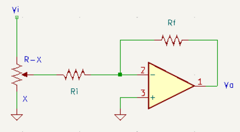
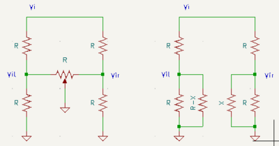

# Theory of Operation

## Input Stage

The Output module accepts line signals (10Vpp) at the inputs. With
$R=100\mathrm{k}\Omega$, the input impedance ranges from $R||R_i$ to
$R$. The gain of the input stage is $A_i = -\frac{R_f}{R_i}$. Gain
options include 2.2 ($R_i = 100k\Omega$, $R_f=220k\Omega$), 4.5
($R_i=47k\Omega$, $R_f=220k\Omega$) or 10 ($R_i=47k\Omega$,
$R_f=470k\Omega$ per MFOS).

## Panning Mixer

At the output of the input gain stage, the panning network sends the
signal to the line out buffers and stereo out amplifiers on the left and
right channels. Here, the lower fixed $R$ also acts as the input
resistance for the inverting summing amplifier (line out buffering), and
$V_{o(l|r)} = -\frac{R_{fo}}{R}\left(V_{i(l|r)1} + V_{i(l|r)2}\right)$.
With the variable resistor $R$ for panning, the voltages $V_{ir}$ and
$V_{il}$ will be in the range $0 \leq V_{i(r|l)} \leq \frac{V_i}{3}$, so
an output stage gain of 3 will restore the signal level.

