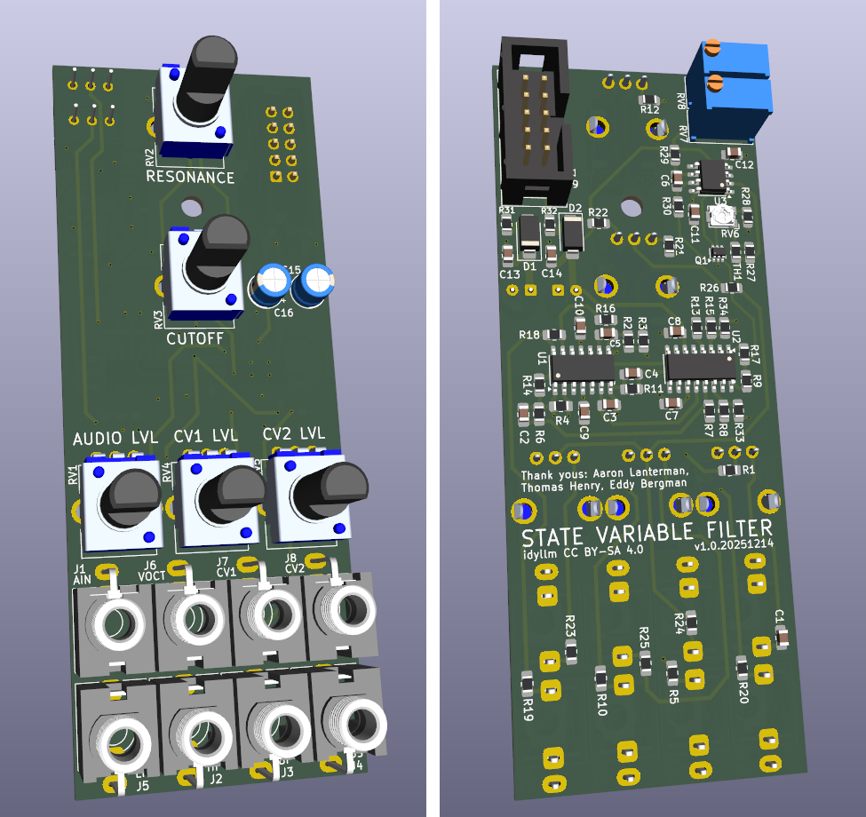
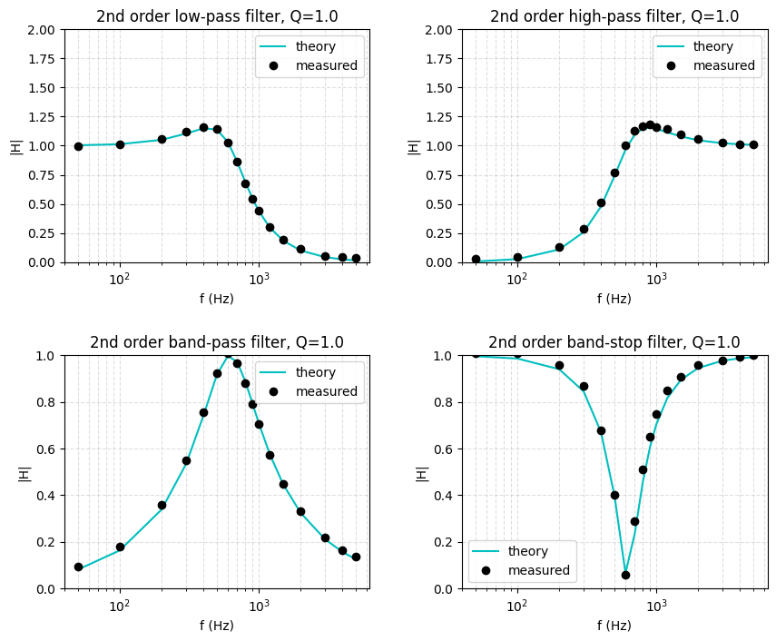

# Assembly Guide

{: width="256"}

## Populate the PCB

### SMT Components

Use of a stencil and solder paste is highly recommended.

* Schottky diodes D1 & D2
* Ferrites R31 & R32
* ICs U1-U3
* Trim pot RV6
* Capacitors C1-C14
* Resistors R1-R22, R33 & R34 and
    * If not using a PTC thermistor (TH1)
        * populate R23-R26 with 100k
        * populate TH1 with 2k2
        * leave R27 unpopulated
    * Otherwise follow the values on the schematic

### THT Components

!!! Note

    Before placing trim pots RV8 and RV9, ensure that they are centered to minimize issues during calibration.

* **Backside**
    * IDC header J9
    * Populate (already centered) RV8 & RV9
* **Frontside**
    * Capacitors C15 & C16
    * Mono jacks J1-J8
    * RV09 potentiometers RV1-RV5

## Measurement and Calibration

### DC Offsets

For background, see the derivation in the [DC Gain Analysis](./dc_gain_analysis.md) section. The choice of outputs for calibration is important: the HP and BP outputs can be tuned independently, while the LP output depends on both the HP and LP offsets as well as the resonance value. Only use the LP output to verify the calibration. 

#### Setup

* Disconnect any audio or CV inputs
* Reduce the resonance to minimum.
* Center the cutoff pot (results are not sensitive to this control).
* Both trim pots (RV8 and RV9) should be centered. 

#### High Pass

* Monitor the HP output.
* Adjust RV7 (corresponding OTA U2A) until the DC offset at the HP output is zero.

#### Band Pass

* Monitor the BP output.
* Adjust RV8 (corresponding OTA U2C) until the DC offset at the BP output is zero.

#### Low Pass

Verify the DC offset at the LP output with the cutoff at maximum. DC offsets below 50mV at the LP output are good. Vary the resonance control (increasing it should decrease the DC offset). There is some higher order interplay between the OTA offsets, so a few passes (HP, BP, LP) might be helpful in practice. Check with an audio signal (e.g. 5Vpp 440Hz) as a final confirmation.

### Calibrating V/oct

tl;dr: leave RV6 in the middle and don't worry about it.

The V/oct input tracking can be adjusted with the trim pot RV6, but I'm not sure how straightforward this is in practice. I've listed two methods that I can think of, but this is likely only useful if you want to use the filter as a VCO in a self-resonant (oscillatory) mode. This also requires adding a fine-adjust potentiometer for the tuning, which I've dropped in favour of a second CV input. 

#### Notch Frequency

This is likely the most straightforward, and may be doable with a sine wave source and a speaker. I did this with an oscilloscope.

1. Alternately apply 1V and 2V to the V/oct input.
2. Apply a sinusoidal source to the audio input (no attenuation).
3. Locate the null in the notch filter output (amplitude goes to zero, phase changes sign) by adjusting the frequency of the sinusoid.
4. Double the frequency of the input and trim RV6 until the change in the null frequency is a factor of 2 (alternate back and forth between *f* and *2f* inputs).

#### Current Probe

This is likely the most accurate way to make the adjustment. I haven't tried this.

1. Alternately apply 1V and 2V to the V/oct input.
2. Create a current probe with a series 15k resistor and probe the current across an unpopulated input resistor for the amplifier bias current to the OTA. 
3. Trim RV6 until the change in current is a factor of 2 when the V/oct input changes by 1V.

#### Self Resonance

Follow the [calibration notes](https://www.eddybergman.com/2024/04/THVCF1statevariablefilter.html) from Eddy Bergman. Basically max out the resonance and play a C2 and C3 while adjusting the trim. Also untested.

### Measurement 

To verify the filter response

1. Use the coarse adjust/cutoff and adjust the bias at the center tap of that potentiometer to 1V (measure VDC with a DMM). Disconnect other inputs (CV and V/oct). 
2. Set the audio level to maximum (no attenuation) and apply an 8Vpp sinusoid to the audio input (use a signal generator).
4. Use the notch filter output to locate the cutoff frequency (where the AC-coupled output amplitude goes to zero and the phase inverts) by adjusting the sinusoid frequency. 
5. With the input frequency at the null of the notch filter response, adjust the resonance until you have unity gain (Q=1) at the output of the bandpass filter. 
6. Sweep the frequency and record the amplitudes for each filter output.

Alternatively, in step 5 adjust the ampltiude to $V_{pp}/\sqrt{2} = 0.707 V_{pp}$. This is equivalent to the maximally flat filter response, and the cutoff frequency can be confirmed for the LPF and HPF by verifying that the amplitude is $V_{pp}/2$.

Plots can be generated using the linked [notebook](./notebook.ipynb). 

## BOM

[Download (.csv)](assets/bom.csv)

