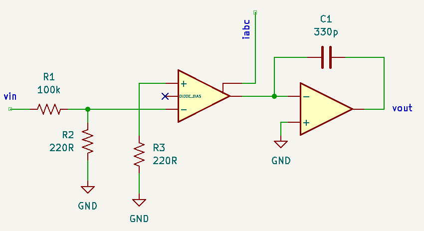

# DC Gain Analysis

When implementing the Thomas Henry design [[ref](#TH-VCF)], I found that there was a persistent DC offset ($\pm 100-300\mathrm{mV}$) at the filter outputs. Ray Wilson made a comment noting this behaviour in the [MFOS](#MFOS-VCF) version and resolved it by adding DC blocking capacitors before buffering the output. 

However, when testing I found that the DC offset at the LP filter output was strongly dependent on the resonance setting and was as large as 1.5V with minimum resonance. While the HP and BP outputs had consistent signs (each stage is non-inverting), the LP output had an additional unexpected sign flip. 

The following is an attempt at a more in-depth analysis of the gain in the feedback loops. I'm starting with a few constraints/assumptions:

* The input voltage is 0V
* The resonance pot is at its minimum but should be kept in the analysis to understand its impact ($R_r$ for the resonance feedback loop is R3=22k at minimum resonance)
* The amplifier bias currents into the OTAs are nominal and matched.
* Ignore the notch filter (summing amplifier)

While checking this in a simulation, I noticed that the design is mainly sensitive to offsets in the OTA inputs. Therefore, I'll also assume ideal opamps ($v_n = v_p$).

Note: the subscripts generally refer to the symbol identifiers in the schematic, e.g. the inverting input of U1A has voltage $v_{n1a}$. 

## First Stage: Inverting Summing Opamp

In a simplified analysis ($A_1 \to \infty$), $v_{n1a} = v_{p1a}= 0 = \Delta v_{1a}$. 

$$\begin{align*}
0 &= - \frac{v_{o1a}}{100} - \frac{v_{o1b}}{R_r} - \frac{v_{o1c}}{100} \\ 
\to v_{o1a} &= -\left(v_{o1b}\frac{100}{R_r} + v_{o1c}\right)
\end{align*}$$ 

## Second Stage: Filter

Stage two combines an OTA and U1B. The inverting input of the OTA is fed by a resistor divider with a gain of $A_{r} = 0.0022$. The gain through the OTA is 

$i_{o2a} = -19.2 i_{abc}\left(v_{n2a}-v_{p2a}\right)$

The DC offset behaviour should be independent of the amplifier bias current $i_{abc}$. This appears to be true in practice: measuring the offsets shows a very weak dependence on the bias current set by the cutoff control. Setting $i_{abc}=52\mu A$ results in a gain factor of $A_{gm} = 1\mathrm{mA/V}$, or 

$i_{o2a} = -A_{gm}\left(v_{n2a}-v_{p2a}\right)$

The non-inverting input of the OTA is grounded, but allowing for an offset (typical up to 0.4mV per datasheet), 

$i_{o2a} = -A_{gm}\left(A_{r} v_{o1a} - \Delta v\right)$

This current is fed through to the integrator. The filter stage in the [Thomas Henry](#TH-VCF) design puts the integrating capacitor in the feedback path of the opamp,

{: width="480"}

The linearized AC gain through this block can be found starting with KCL into $v_{n1}$ (the inverting input of the opamp). Assuming an ideal opamp, $v_{n1} = v_{p1} = 0$, 

$$\begin{align*}
0 &= i_{o2a} + sC\left(v_{o1b} - v_{n1b}\right) \\
\to 0 &= i_{o2a} + sC v_{o1b} \\
\to v_{o1b} &= \frac{A_{gm}}{sC}\left(A_{r} v_{o1a} - \Delta v_1\right)
\end{align*}$$

where $\Delta v_1$ is the offest in the first OTA.

Substituting for $v_{o1a}$

$$\begin{align*}
\to v_{o1b} &= -\frac{A_{gm}}{sC}\left[A_{r}\left(v_{o1b}\underbrace{\frac{100}{R_r}}_{A_x} + v_{o1c}\right) + \Delta v_1 \right] \\
\to v_{o1b} &= -\frac{A_{gm}}{sC}\left[A_{r}A_x v_{o1b} + A_r v_{o1c} + \Delta v_1\right] \\
\to v_{o1b}\left(1 + \frac{A_{gm}A_{r}A_x}{sC} \right) &= -\frac{A_{gm}}{sC}\left[A_r v_{o1c} + \Delta v_1 \right] \\
\to v_{o1b}\left(sC + A_{gm}A_{r}A_x\right) &= -A_{gm}\left[A_r v_{o1c} + \Delta v_1 \right] \\
\end{align*}$$

## Third Stage: Filter

The topology of the third stage matches the second, with the input from stage 2: $v_{i} = v_{o1b}$. The transfer function with OTA offset $\Delta v$ is

$$\begin{align*}
v_{o1c} &= \frac{A_{gm}}{sC} \left(A_r v_{o1b} - \Delta v_2\right) \\
\to v_{o1b} &= \frac{sC}{A_{gm}A_r}v_{o1c} +\frac{1}{A_r}\Delta v_2 
\end{align*}$$

Substituting for $v_{o1b}$

$$\begin{align*}
\to \left(\frac{sC}{A_{gm}A_r}v_{o1c} +\frac{1}{A_r}\Delta v_2\right)\left(1 + \frac{A_{gm}A_{r}A_x}{sC} \right) &= -\frac{A_{gm}}{sC}\left[A_r v_{o1c} + \Delta v_1 \right] \\
\to \frac{sC}{A_{gm}A_r}v_{o1c} + A_x v_{o1c} + \frac{1}{A_r}\Delta v_2 + \frac{A_{gm}A_x}{sC}\Delta v_2 &= -\frac{A_{gm}A_r}{sC}v_{o1c} - \frac{A_{gm}}{sC}\Delta v_1 \\
\to \frac{(sC)^2}{A_{gm}A_r}v_{o1c} + s C A_x v_{o1c} + \frac{sC}{A_r}\Delta v_2 + A_{gm}A_x\Delta v_2 &= -A_{gm}A_rv_{o1c} - A_{gm}\Delta v_1 
\end{align*}$$

## DC Response

Letting $sC \to 0$ in the previous expression yields the DC dependence of the LP output on the OTA offset voltages:

$$\begin{align*}
\to A_{gm}A_x\Delta v_2 &= -A_{gm}A_rv_{o1c} - A_{gm}\Delta v_1 \\
\to v_{o1c} &= -\frac{1}{A_r}\left(\Delta v_1 + A_x\Delta v_2\right) ,\quad\mathrm{(low\ pass)}\\
\end{align*}$$

Since $A_r \ll 1$, the attenuating resistive divider contributes significantly. Also, the dependence on the resonance feedback resistor is seen in $A_x = \frac{100\mathrm{k}}{R_r}$: $\Delta v_2$ can contriubte 5x more than $\Delta v_1$.

To get a DC expression for $v_{o1b}$ (BP output), let $sC \to 0$ in the previous expression for $v_{o1b}$ and substitute $v_{o1c}$:

$$\begin{align*}
\to v_{o1b} &= -\frac{1}{A_{r}A_x}\left[A_r v_{o1c} + \Delta v_1 \right] \\
 &= -\frac{1}{A_{r}A_x}\left[A_r \left(-\frac{1}{A_r}\left(\Delta v_1 + A_x\Delta v_2\right)\right) + \Delta v_1 \right] \\
 &= -\frac{1}{A_{r}A_x}\left(-\Delta v_1 - A_x\Delta v_2 + \Delta v_1 \right) \\
 &= \frac{\Delta v_2}{A_{r}} ,\quad\mathrm{(band\ pass)}\\
\end{align*}$$

This is independent of the resonance feedback. Using the typical datasheet offset value 0.3mV, this contributes a DC value of -136mV.

Finally, the DC expression for $v_{o1a}$ (HP output) is 

$$\begin{align*}
\to v_{o1a} &= -\left(v_{o1b}A_x + v_{o1c}\right) \\
&= -\left[\frac{A_x}{A_r}\Delta v_2  -\frac{1}{A_r}\left(\Delta v_1 + A_x\Delta v_2\right)\right]\\
& = \frac{\Delta v_1}{A_r} ,\quad\mathrm{(high\ pass)}\\
\end{align*}$$ 

This behaviour can be verified in a [Falstad simulation](https://tinyurl.com/22pnvoag). 

## Observations

The DC offsets are only a function of four parameters: the offsets of the two OTAs, the gain of the resistor divider, and the weighting of the resonance feedback in the summing amplifier. Consequently, the offests are

* Independent of the type of OTA (offset voltage dependent)
* Independent of the amplifier bias current (confirmed via measurments and simulations)
* Dominate over offsets from the opamps (confirmed via measurements and simulations)

In addition

* the non-intuitive sign behaviour comes out of the derivation (the DC offset at the LP filter has the opposite sign as the HP & BP outputs)
* the DC offset at the BP output ($v_{o1b}$) only depends on the input offset in the last stage ($\Delta v_2$); it's independent of the resonance feedback
* similarly, the DC offset at the HP output ($v_{o1a}$) only depends on the input offset in the middle stage ($\Delta v_1$); it's independent of the resonance feedback
* the DC offset for the LP output *depends on the resonance feedback*

The last few points are important: trimming out the offset will only work if both $\Delta v_1$ *and* $\Delta v_2$ are reduced to zero, and that must be checked independently at the HP and BP outputs. 

## References

1. Thomas Henry, "VCF-1", [birthofasynth.com](https://www.birthofasynth.com/Thomas_Henry/Pages/VCF-1.html)
2. Ray Wilson, "State Variable VCF 12dB/oct with VC Resonance", [MFOS](https://musicfromouterspace.com/analogsynth_new/STATEVARVCFFEB2006/STATEVARVCFFEB2006.html)
3. "LM13700 Dual Operational Transconductance Amps w/Linearizing Diodes and Buffers datasheet", [Texas Instruments](https://www.ti.com/lit/gpn/lm13700)
