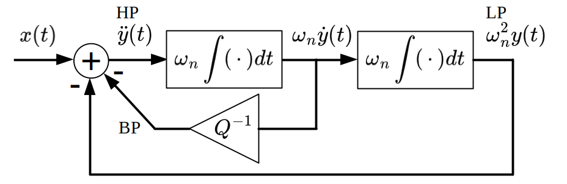
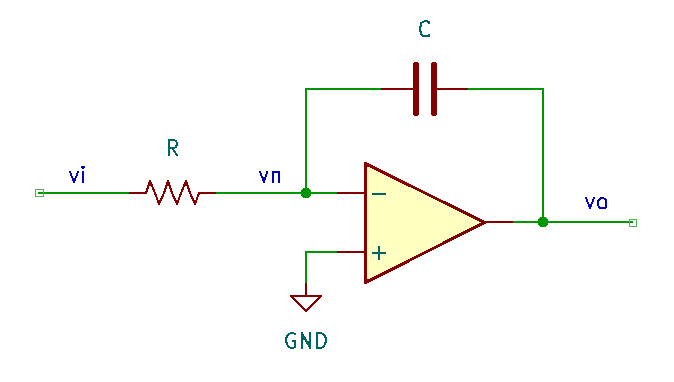
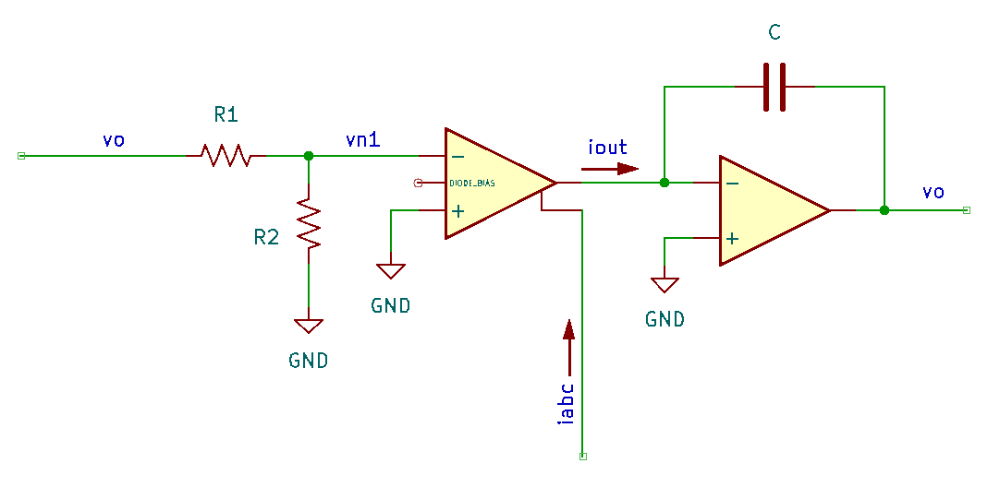
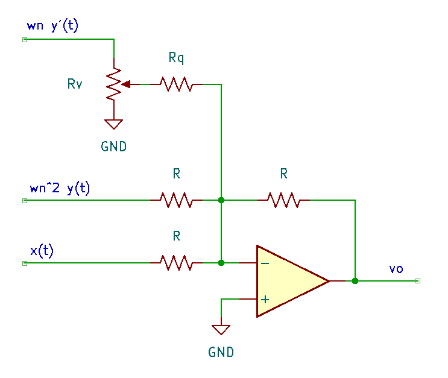
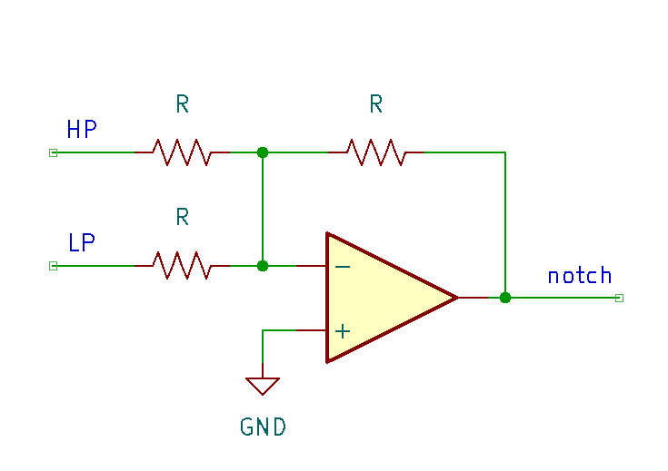

# Module Design

## Overview

This document covers the theory behind the state variable filter and three key design elements:

* opamp integrators
* resonance feedback
* notch filter output

Another important sub-circuit is the linear voltage to exponential current conversion for V/oct tracking. This is a common building block, so I'll refer to the reference for that one. 

## Theory and Derivation

The derivation follows the same outline as Aaron Lanterman's lecture [[1](#Lanterman-L24)]. In a cannonical form, the second-order filters have the following transfer functions

$$\begin{align*}
H_{LP}(s) &= \frac{\omega_n^2}{s^2 + \frac{\omega_n}{Q}s + \omega_n^2} & \quad\mathrm{(low pass)} \\
H_{BP}(s) &= \frac{\frac{\omega_n}{Q}s}{s^2 + \frac{\omega_n}{Q}s + \omega_n^2} & \quad\mathrm{(band pass)} \\
H_{HP}(s) &= \frac{s^2}{s^2 + \frac{\omega_n}{Q}s + \omega_n^2} & \quad\mathrm{(high pass)}
\end{align*}$$

These share a common denominator, and this can be re-written in the time domain

$$\begin{align*}
H_G(s) = \frac{Y(s)}{X(s)} &=\frac{1}{s^2 + \frac{\omega_n}{Q}s + \omega_n^2} \\
\to X(s) &= Y(s)\left[s^2 + \frac{\omega_n}{Q}s + \omega_n^2\right] \\
\to X(s) &= s^2 Y(s)+ \frac{\omega_n}{Q}sY(s) + \omega_n^2Y(s) \\
\to x(t) &= \ddot{y}(t) + \frac{\omega_n}{Q}\dot{y}(y)  + \omega_n^2y(t)
\end{align*}$$

using $s \to \frac{d}{dt}$ ([differentiation property](https://en.wikipedia.org/wiki/Fourier_transform#Differentiation) of the Fourier Transform). Re-arranging this equation as 

$$\begin{align*}
\ddot{y}(t) &= x(t) - \frac{\omega_n}{Q}\dot{y}(y) - \omega_n^2y(t)
\end{align*}$$

forms the basis for the state variable filter. Note that the operator $\omega_n \int (\cdot) dt$ can be applied to $\ddot{y}(t)$ to generate terms in that equation:

$$\begin{align*}
\omega_n \int \ddot{y}(t) dt &\to \omega_n \dot{y}(t) \\
\omega_n \int \left(\omega_n \dot{y}(t)\right) dt &\to \omega^2_n y(t)
\end{align*}$$

These intermediate terms can also be associated with the low-, band-, and high-pass filters:

$$\begin{align*}
\omega^2_n y(t) &\to \omega^2_n Y(s) = Y_{LP}(s) = \frac{\omega^2_n X(s)}{s^2 + \frac{\omega_n}{Q}s + \omega_n^2} &\to H_{LP}(s) \\
\omega_n \dot{y}(t) &\to \omega_n s Y(s) = Y_{BP}(s) = \frac{\omega_n s X(s)}{s^2 + \frac{\omega_n}{Q}s + \omega_n^2} &\to Q H_{BP}(s) \\
\ddot{y}(t) &\to s^2 Y(s) = Y_{HP}(s) = \frac{s^2 X(s)}{s^2 + \frac{\omega_n}{Q}s + \omega_n^2} &\to H_{HP}(s)
\end{align*}$$

This is illustrated in the block diagram, below. Note the signs on the terms entering the summing node.

{: width="640"}

!!! note

    In practice, the bandpass output is taken before the gain 1/Q, because that's where the low-impedance buffer output is. The gain is often implemented with a potentiometer, which would require an extra buffer to provide the normalized output. As a result, the gain of the bandpass output depends on the resonance adjustment, i.e. it contains an additional factor of Q. 

## Integrators

An opamp with a capacitor in the feedback path acts as an integrator.

{: width="480"}

Equating the currents into node $v_n$,

$$\begin{align*}
\frac{v_i - v_n}{R} &= \left(v_n - v_o\right) sC \\
v_n &= v_p =0 \quad\mathrm{(virtual\ ground)}\\
\to \frac{v_o}{v_i} &= -\frac{1}{sRC} = -\frac{\omega_n}{j\omega}
\end{align*}$$

where $\omega_n = RC$. By adjusting $R$, the corner frequency can be shifted. 

Replacing the resistor with an OTA enables control of the equivalent resistance according to

$$\begin{align*}
g_m &= \frac{i_{abc}}{2 V_T} \simeq 19.2 i_{abc} \\
i_{out} &= g_m(v_{p1}-v_{n1}) = -g_m v_{n1} = -19.2 i_{abc} v_{n1}
\end{align*}$$

{: width="640"}

Returning to the transfer function for the filter,

$$\begin{align*}
i_{out} &= -19.2 i_{abc} v_{n1}  = - v_o sC \\
\to \frac{v_o}{v_{n1}} &= \frac{19.2 i_{abc}}{sC} 
\end{align*}$$

A voltage divider is used to reduce the input signal voltage: $v_{n1} = \frac{R_2}{R_1 + R_2} v_{in}$ with $R_2 \ll R_1$. The linear region for the OTA is nominally in the range where $|v_{p1} - v_{n1}| < 10mV$. Assuming a 10Vpp input signal, choose the ratio for $R_2$ and $R_1$

$$\begin{align*}
0.01 &= \frac{R_2}{R_1} 5 \\
\to R_1 &= 500 R_2
\end{align*}$$

For $R_1 = 100k\Omega$, $R_2 = 220\Omega$ will approximately satisfy
this condition. The gain of the OTA stage is then

$$\begin{align*}
v_{out} &\simeq 19.2 \frac{220}{10^5} \frac{i_{abc}}{sC} v_{in} = \frac{\omega_n}{j\omega}v_{in}\\
\mathrm{with}\quad \omega_n &= 19.2 i_{abc}\frac{220}{10^5} \frac{1}{C}
\end{align*}$$

This is equivalent to the integrator with gain $\omega_n$ in the block diagram. 

The control current $i_{abc}$ can span about 3 orders of magnitude, e.g. 0.5-500uA, and should remain less than 1mA. When $C=330\mathrm{pF}$, 

$$\omega_n = 128 \times i_{abc} [\mathrm{\mu A}] \to f_n \simeq 20\mathrm{Hz} \times i_{abc}[\mathrm{\mu A}]$$

which gives a cutoff range from 20Hz to 20kHz over the practical values for $i_{abc}$.

## Feedback

The sign-inverted outputs of both integrator blocks are fed back to sum with the input signal. Note that this can be accomplished with a inverting summing buffer: the input audio signal $x(t)$ is also inverted, but this only ammounts to a phase and can be neglected. The inverting summing buffer is shown below

{: width="480"}

Since $v_n$ is at a virtual ground, the gain for each branch can be calculated independently as $v_{o,i} = -(R_f/R_i)v_{i}$. In the case of the resonance feedback, a gain of $Q^{-1}$ is implemented with the variable resistor $R_v$ and the fixed resistor $R_q$. The input resistance seen in the resonance feedback branch ($\omega_n \dot{y}$) is

$$R_1 = \alpha R_v \parallel R_q + (1-\alpha)R_v$$

such that the current in $R_q$ is ($v_1$ corresponds to $\omega_n \dot{y}$)

$$\begin{align*}
i_{Rq} &= \frac{v^*}{R_q} = \frac{v_1 - \frac{v_1}{R_1}(1-\alpha)R_v}{R_q} = \frac{v_1}{R_q} - \frac{v_1(1-\alpha)R_v}{R_1 R_q} \\
&= \frac{v_1}{R_q} \left[1 - \frac{(1-\alpha)R_v}{R_1}\right]
\end{align*}$$

This is equivalent to the current through the feedback resistor $R$:

$$\begin{align*}
-\frac{v_o}{R} &= i_{Rq} = \frac{v_1}{R_q} \left[1 - \frac{(1-\alpha)R_v}{R_1}\right] \\
\to \frac{v_o}{v_1} &= -\frac{R}{R_q} \underbrace{\left[1 - \frac{(1-\alpha)R_v}{R_1}\right]}_{A_\alpha} = -\frac{R}{R_q}A_\alpha
\end{align*}$$

When $\alpha=0$ ($R_q$ to ground), $R_1 = R_v$ and the gain factor $A_\alpha = 0$ such that the overall gain for the resonance feedback branch is zero, which is equivalent to $Q=\infty$. At the opposite end, $\alpha = 1$, $R_1 = R_v \parallel R_q$, and $A_\alpha = 1$. The gain in the resonance feedback path is then $-\frac{R}{R_q}$ and $Q=\frac{R_q}{R}$: choosing $R \approx 4R_q$ enables the supression of a peak in the resonance. 

Following the Thomas Henry design, let $R=100\mathrm{k\Omega}$ and $R_q = 22\mathrm{k\Omega}$ with $R_v = \mathrm{B}100\mathrm{k\Omega}$ and a small $47\Omega$ tail resistor to prevent the complete cutoff of this feedback path.

## Notch Filter

Three opamps are required for the core of the state variable filter (two integrators and a summing buffer), which leaves a spare. Summing the high- and low- pass outputs generates a notch or band-stop filter.

{: width="480"}

An additional idea (not implemented) is to also add the input signal, which enables the adjustment of the depth of the notch [[2](#SVF-tutorial)]. This could be achieved separately by mixing the filter output with un-filtered signal. 

## Linear to Exponential Conversion

The linear voltage to exponential current conversion theory is described in the Building Blocks section. The design is adapted slightly to accomodate currently available PTC thermistors (e.g. 2k 3900ppm/C) with a fixed resistance in parallel. In the VCF, temperature compensation is not too critical, so

* the PTC thermistor can be omitted (don't populate)
* the feedback resistor and V/oct input resistance can be replaced with $R_f = 2.2\mathrm{k\Omega}$ and $R_i = 100\mathrm{k\Omega}$, respectively. This can be tuned with the $100\Omega$ trim + $220\Omega$ fixed resistors.
* all other $82\mathrm{k\Omega}$ input resistors can be replaced with $R_i = 100\mathrm{k\Omega}$

Additionally, the LM13700 amplifier bias current goes *into* the OTA from a positive supply. Therefore, the linear to exponential conversion circuit is inverted (using matched PNP transistors for the current mirror). 

The reference current sets the value for $i_{abc}$ when the net input is at 0V: a 12V drop across the reference resistance $R_{ref}=560\mathrm{k\Omega}$ results in $I_{ref} = 21\mathrm{\mu A}$, which is distributed to the two OTAs (approximately $10\mathrm{\mu A}$ each). Note that in practice, an offset adjustment (cutoff) is provided to set the amplifier bias currents when V/oct is zero. 

The $15\mathrm{k\Omega}$ resistors to the amplifier bias current inputs of the OTAs limit the total current to approximately $800\mathrm{\mu A}$ each. The emitter resistance of the differential pair is reduced to $4.7\mathrm{k\Omega}$ to ensure that the BJTs remain active. This limit is reached when the net input exceeds 9V.

A [Falstad simulation](https://tinyurl.com/2bfvn379) was used to check the values.

## References

1. Aaron Lanterman, "ECE4450 L24: State Varaiable Filters and the Oberheim SEM VCF" [youtube](https://www.youtube.com/watch?v=jAokGV71MEw)
2. "State Variable Filter" [electronics-tutorials.ws](https://www.electronics-tutorials.ws/filter/state-variable-filter.html)