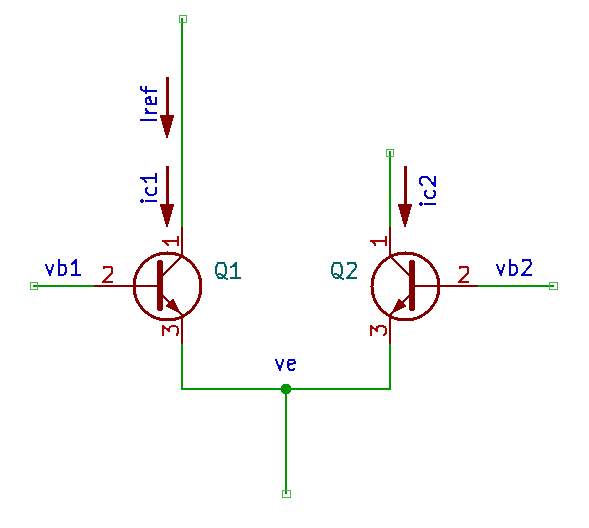
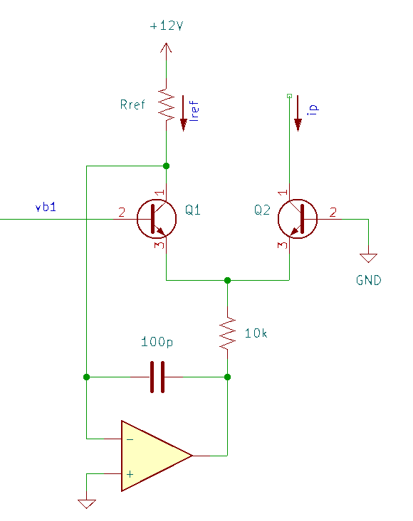
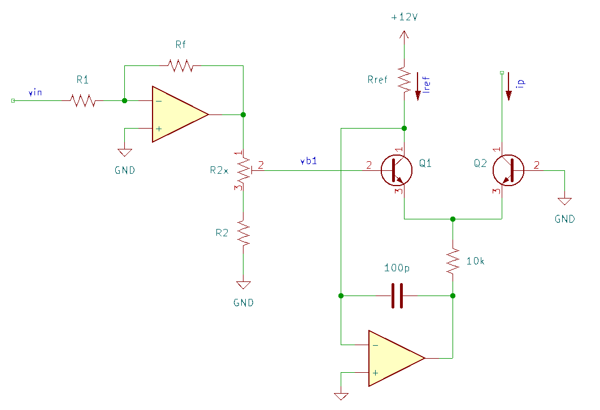
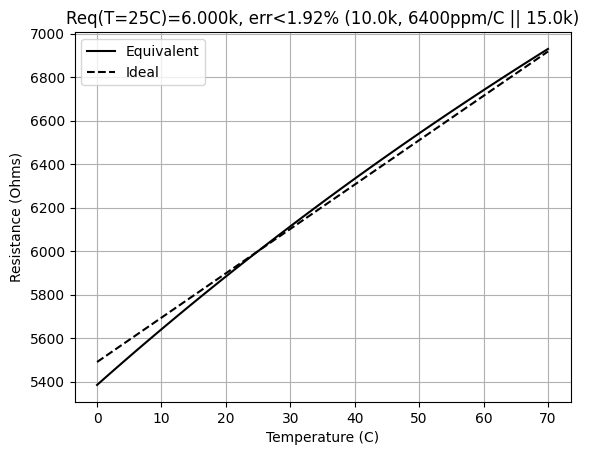
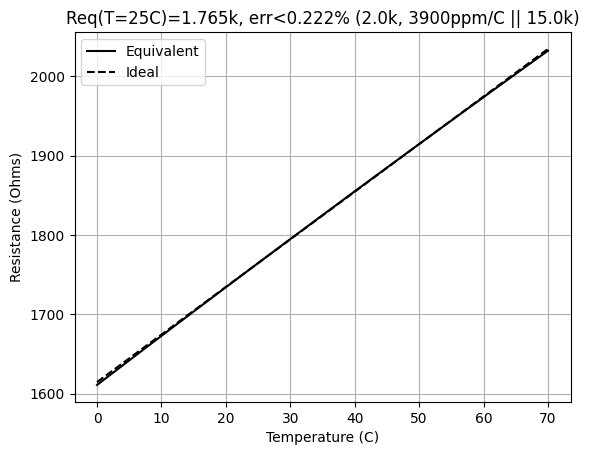
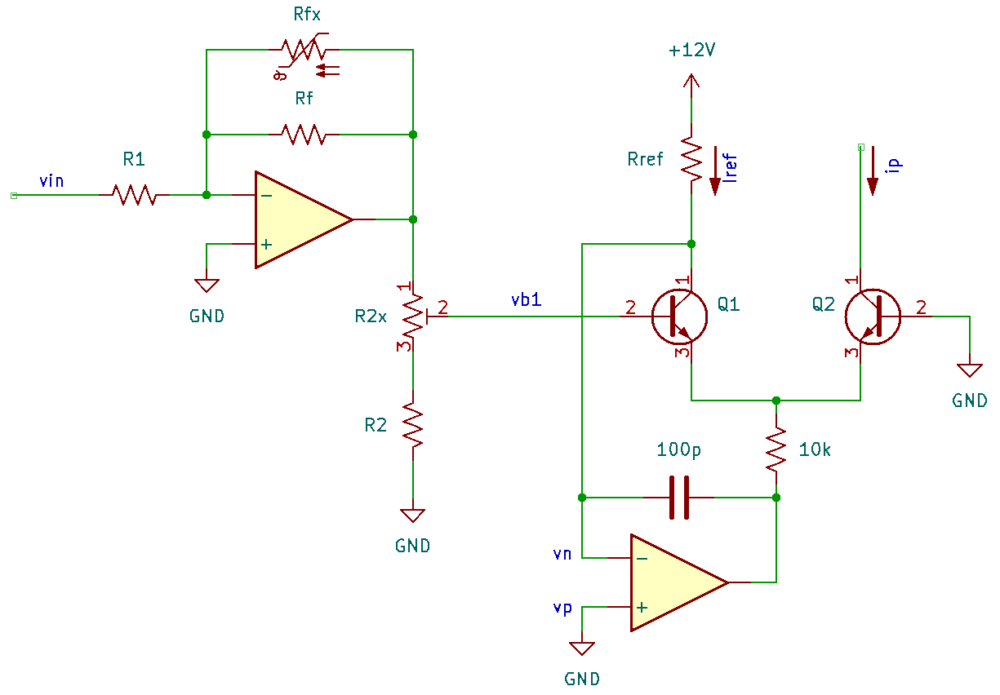

# Linear to Exponential Voltage Conversion

## Overview 

Conversion from a linearly varying control voltage to an exponential current is a key building block for VCOs, VCFs, etc.: we perceive differences in audio signals in relative ratios (e.g. an octave is a doubling in $f_0$). There are a few references that this design is based on, and those are a good starting point to understand the circuit (see the References section below):

* Hal Chamberlain's *Musical Applications of Microprocessors*. The section on the VCO includes this block, but if you can't find that book, ...
* Rene Schmitz's "tutorial on exponential converters and temperature compensation", which goes into more detail on temperature compensation,
* and finally, in an excellent lecture-style presentation, Aaron Lanterman's "Exponential Voltage-to-Current Conversion & Tempco Resistors" video.

In this note, I'm documenting the design steps for the core circuit, but will also collect other variations as I find them. The main thing I've added in these notes are derivations for including a normal resistor in parallel with the PTC thermistor in the feedback of the input gain stage, which can help approximate the desired thermal response when the classic 3300ppm/C thermistors are nowhere to be found.

## Design

### Differential Pair

The design starts with a BJT differential pair. 

{: width="480"}

Using the relationship between $v_{be}$ and $i_c$ for a BJT ($i_c = I_S \exp\left(v_{be}/V_T\right)$) and assuming that the transistors are matched ($I_{S1} = I_{S2}$), the collector current in Q2 ($i_{c2}$) is related to the difference in the voltages at the bases when the emitters are at the same voltage $v_e$:

$$\begin{align*}
\frac{i_{c2}}{i_{c1}} &= \frac{I_{S2}\exp\left(v_{be2}/V_T\right)}{I_{S1}\exp\left(v_{be1}/V_T\right)} \\
\to i_{c2} &= i_{c1}\exp \left(\frac{v_{b2} - v_{e} - v_{b1} + v_{e}}{V_T}\right) =  i_{c1}\exp \left(\frac{v_{b2} - v_{b1}}{V_T}\right)
\end{align*}$$

 Grounding the base of Q2 sets $v_{b2} = 0$ and with $i_{c1} = I_{ref}$ 
 
 $$i_{c2} = I_{ref}\exp(-\frac{v_{b1}}{V_T})$$

 !!! note

    The choice of setting vb1 or vb2 to ground will change the sign on the input voltage, so inverting and non-inverting inputs can be constructed. The inverting input is useful when preceded by an inverting opamp buffer/sum.

The voltage difference across $R_{ref}$ sets the reference current $I_{ref} = i_{c1}$. The voltage on the high side is set by the supply and on the low side by the op-amp, which replicates the reference voltage $V_n = 0$ at the non-inverting input to the collector of Q1. The circuit (described in [1]) is shown below:

{: width="480"}

### Input Stage Gain for V/Oct

To establish the desired gain of an input stage, let $v_{b1} = A v_{in}$. When the input increases by 1V, the output current $i_p = i_{c2}$ should double:

$$\begin{aligned}
i_p &= I_{ref} \exp\left(-\frac{A v_{in}}{V_T}\right) \\
2i_p &= I_{ref} \exp\left(-\frac{A (v_{in} + \Delta v_{in}}{V_T}\right) \\
\to \frac{2 i_p}{i_p} = 2 &= \exp\left(-\frac{A \Delta v_{in}}{V_T}\right) \\
\to \ln 2 &= -\frac{A \Delta v_{in}}{V_T} \\
\to A &= -\frac{V_T \ln 2}{1} = 0.693 V_T \approx -0.018 = -\frac{1}{55.5}
\end{aligned}$$

The value of $i_{p}$ will be equal to $I_{ref}$ when $v_{in}$ is at its minimum. This will set the smallest current. 

An op-amp in an inverting gain configuration with a voltage divider supplies $v_{b1}$.

$$\begin{aligned}
A &= -0.693 V_T = -0.018 \simeq -\frac{1}{55.5} = -\frac{R_f}{R_1} \frac{R_2 + \alpha R_{2x}}{R_2 + R_{2x}} \\
\to \frac{1}{55.5} &= \frac{2\mathrm{k}\Omega}{100\mathrm{k}\Omega} \frac{440\Omega}{490\Omega}
\end{aligned}$$

where $R_{2x}$ is adjusted such that the voltage divider gives a gain of $0.9$. The choice of $R_f = 2\mathrm{k}\Omega$ comes from a "common" (50 years ago) value of positive-temperature coefficient (PTC) resistors (details in the next section). Multiple inputs can be summed via $100\mathrm{k}\Omega$ input resistors. The voltage divider typically consists of a fixed $390\Omega$ resistor and a $100\Omega$ trim pot, enabling tuning to get V/Oct behaviour.

{: width="640"}

### Temperature Compensation

Continuing with Lanterman's derivation, replace $R_f$ with a PTC resistor, $R_f = R_0[1+\alpha(T-T_0)]$ where $\alpha$ is the thermal
coefficient (note: use $A'$ in place of $\tilde{\mathfrak{s}}$). The "P" in PTC is important: the resistance must increase with increasing temperature.

$$\begin{aligned}
A = -\frac{R_f}{R_1}A' &= -\frac{R_0[1+\alpha(T-T_0)]}{R_1}A' = -\underbrace{0.693}_{B} V_T \\
\to \frac{R_0[1+\alpha(T-T_0)]}{R_1}A' &= \frac{kT}{q}B = \frac{k[T_0 + (T-T_0)]}{q}B \\
&= \underbrace{\frac{kT_0}{q}}_{V_{T0}}B + \frac{kT_0}{q}\frac{(T- T_0)}{T_0}B \\
\to \frac{R_0}{R_1}A' + \frac{\alpha R_0 (T-T_0)}{R_1}A' &= \underbrace{V_{T0}B}_{A_0} + \frac{V_{T0}}{T_0}B (T- T_0) \\
\mathrm{let}\quad A_0 &\equiv \frac{R_0}{R_1}A' = V_{T0}B \\
\to \frac{\alpha R_0 (T-T_0)}{R_1}A' &= A_0 \alpha(T-T_0) = \underbrace{V_{T0}B}_{A_0}\frac{1}{T_0}(T- T_0) \\
\to \alpha &= \frac{1}{T_0} = 0.0034
\end{aligned}$$

Note that the temperature coefficient is positive. It\'s hard to find
3300ppm tempco resistors in 2025, so here\'s an alternative derivation
where $R_f = R_{f1}\parallel R_{f2}$ where $R_{f1}$ is a tempco resistor
and $R_{f2}$ is a regular resistor (assumed constant in temperature).

$$\begin{aligned}
R_{f1}\parallel R_{f2} &= \frac{R_{f1}R_{f2}}{R_{f1} + R_{f2}} \\
&= \frac{R_0[1+\alpha(T-T_0)]R_{f2}}{R_0[1+\alpha(T-T_0)] + R_{f2}} \\
&= R_0\frac{1 + \alpha(T-T_0)}{\frac{R_0}{R_{f2}}[1+ \alpha(T-T_0)] + 1} \\
&= R_0\frac{1 + \alpha(T-T_0)}{\left(1 + \frac{R_0}{R_{f2}}\right) + \underbrace{\frac{R_0}{R_{f2}}\alpha}_{\alpha'}(T-T_0)} \\
\end{aligned}$$

Assuming $\alpha'(T-T_0) \ll 1$ (prefer $R_{f2} > R_0$)

$$\frac{1}{p + \alpha(T-T_0)} \approx \frac{1}{p} - \frac{\alpha(T-T_0)}{p^2}$$

such that

$$\begin{aligned}
R_{f1}\parallel R_{f2} &\approx R_0\left[1 + \alpha(T-T_0)\right]\left(\frac{R_{f2}}{R_0 + R_{f2}}\right) \left[ 1 - \frac{R_{f2}\alpha'(T-T_0)}{R_0 + R_{f2}}\right] \\
&= \left(\frac{R_0 R_{f2}}{R_0 + R_{f2}}\right)\left[1 + \alpha(T-T_0)\right] \left[ 1 - \underbrace{\frac{R_0}{R_0 + R_{f2}}}_{\gamma}\alpha(T-T_0)\right] \\
&= \left(\frac{R_0 R_{f2}}{R_0 + R_{f2}}\right)\left[1 + \alpha(T-T_0)\right] \left[ 1 - \gamma\alpha(T-T_0)\right] \\
&= \left(\frac{R_0 R_{f2}}{R_0 + R_{f2}}\right)\left[1 + (1-\gamma)\alpha(T-T_0) - \gamma\alpha^2(T-T_0)^2\right]\\
\end{aligned}$$

Given an available PTC resistor with resistance $R_0$ and temperature
coefficient $\alpha_0 > \alpha = 0.0034$, the parallel resistance
$R_{f2}$ can be found as

$$\begin{aligned}
\alpha &= (1-\gamma)\alpha_0 = \left(1 - \frac{R_0}{R_0 + R_{f2}}\right)\alpha_0 \\
\to \frac{R_0}{R_0 + R_{f2}} &= 1 - \frac{\alpha}{\alpha_0} \\
\to \frac{R_0\alpha_0}{\alpha_0 - \alpha} &= R_0 + R_{f2} \\
\to R_{f2} &= R_0\left(\frac{\alpha_0}{\alpha_0 - \alpha} - 1\right) = R_0\left(\frac{\alpha}{\alpha_0 - \alpha}\right)
\end{aligned}$$

The following table collects a few currently manufactured parts available on Digikey (as of 2025):

|Mfg.               |Part \#            |Package    |$R_0\ (\mathrm{k}\Omega)$  |$\alpha (\mathrm{ppm/K})$|
|-------------------|-------------------|-----------|---------------------------|-------------------------|
|KOA Speer          |LT732ATTD202J3900  |0805       |2                          |3900|
|KOA Speer          |LT732ATTD102J3600  |0805       |1                          |3600|
|Vishay Dale        |TFPT1206L1002FM    |1206       |10                         |4110|
|Vishay Dale        |TFPTL15L5001FL2B   |THT 2.5mm  |5                          |4110|
|Texas Instruments  |TMP6131LPGM        |TO90-2     |10                         |6400|

As an example, the TMP6121LPGM (10k, 6400ppm/C TCR with 1% tolerance) in parallel with a 15k resistor approximates a 6k resistor with a 3400ppm/C temperature with a maximum error of less than 2% over the range from 0-70C.

A second example is the LT732ATTD202J3900 (2k, 3900ppm/C TCR with 10% tolerance) in parallel with a 15k resistor. This configuration
approximates a 1.765k resistor with a 3400ppm/C TCR to less than 0.3% over the range from 0-70C.

With $R_{f}\parallel R_{fx} = 1.765\mathrm{k}\Omega$ (2k PTC thermistor in parallel with a 15k resistor), $R_1 = 82\mathrm{k}\Omega$ gives an approximate gain in the inverting amplifier of $0.0215$ per the design requirement (the remaining fraction can be tuned in a $100\Omega$ trim pot in series with a $220\Omega$ resistor in the voltage divider -- note that this is different than the classic 100+390 pair).

A schematic of the complete block is shown below.

{: width="640"}

## References

1.  Hal Chamberlain, *Musical Applications of Microprocessors*, 2nd Ed.,
    Hayden Books, 1985
2.  Rene Schmitz, "A tutorial on exponential converters and temperature
    compensation", [[schmitzbits.de](https://schmitzbits.de/expo_tutorial/index.html)]
3.  Aaron Lanterman, "ECE4450 L18: Exponential Voltage-to-Current
    Conversion & Tempco Resistors",
    [[youtube](https://www.youtube.com/watch?v=ZWJhApUmfEU)]
4.  Paul Horowitz and Winfield Hill, *The Art of Electronics*, 3rd Ed.,
    Cambridge University Press, 2015
